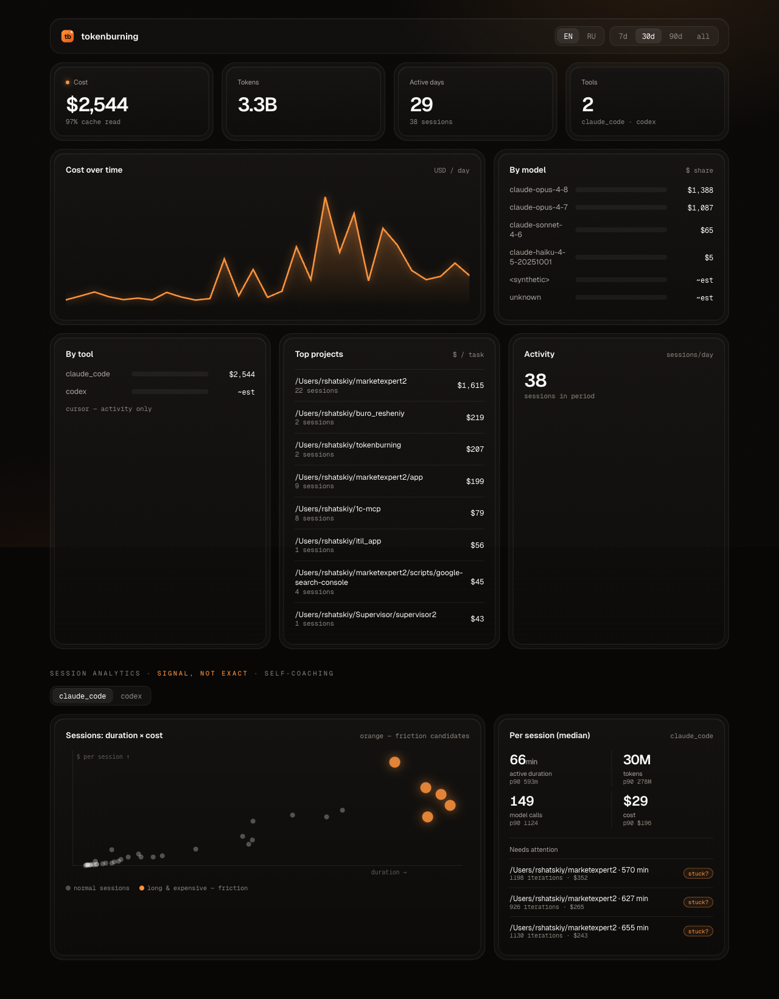

<div align="center">

# 🔥 tokenburning

**One dashboard for everything your AI coding tools cost you.**

Cost, tokens, activity and session analytics across Claude Code, Codex, Cursor, Gemini CLI, GitHub Copilot, OpenCode and the Cline family — one static binary, installs in seconds, sends nothing to the network by default.

[](https://github.com/rshatskiy/tokenburning/actions/workflows/ci.yml)
[](https://github.com/rshatskiy/tokenburning/releases)
[](LICENSE)
[](go.mod)

[Русская версия →](README.ru.md) · [tokenburning.online](https://tokenburning.online) · [tokenburning.ru](https://tokenburning.ru)



</div>

---

## Why

You run Claude Code, Cursor and Codex every day — and you have no idea what they cost you in total, or where the money actually burns. The numbers sit in three different local log formats, and none of them add up for you.

`tokenburning` reads those logs **locally**, prices them, and shows you in one view: total spend, where it goes by tool / model / project, and how your work sessions actually look. One `curl | sh`, a local dashboard, nothing leaves your machine.

> Running a team? There's an optional, consent-gated rollup — see [Teams](#teams--optional-team-rollup).

- **Local-first.** The collector runs on your machine; the dashboard binds to `127.0.0.1` with a bearer token. Zero network egress by default.
- **Honest.** Unpriced models are flagged `~est`; session analytics are labeled "signal, not exact". No guessing dressed up as fact.
- **Private by construction.** If you opt into the team rollup, only *derived aggregates* leave — no source, no prompts, no project paths, no precise timestamps.

## Install

**macOS / Linux:**
```sh
curl -fsSL https://raw.githubusercontent.com/rshatskiy/tokenburning/main/install.sh | sh
```

**Windows (PowerShell):**
```powershell
irm https://raw.githubusercontent.com/rshatskiy/tokenburning/main/install.ps1 | iex
```

Or grab a binary for your OS/arch from [Releases](https://github.com/rshatskiy/tokenburning/releases) (macOS, Linux, Windows × amd64/arm64).

## Use

```sh
tokenburning scan        # parse local logs, print cost by tool/model
tokenburning scan --period today --format json   # periods, filters, JSON/CSV export
tokenburning status      # one-liner: today + month (for status bars)
tokenburning plan set claude-max   # show "extracted ×N from your plan"
tokenburning dashboard   # open the local web dashboard (127.0.0.1, token-gated)
tokenburning update      # self-update to the latest release (SHA-256 verified)
tokenburning version
```

`scan` gives you the numbers instantly:

```text
TOOL             EVENTS         TOKENS    COST(USD)
claude_code       17530     4013184183       2964.2
codex                 1          94109          0.0
cursor              494              0          0.0

MODEL                        EVENTS    COST(USD)
claude-opus-4-7                6251       1499.0
claude-opus-4-8                7062       1395.0
claude-sonnet-4-6              3778         65.1
claude-haiku-4-5-20251001       338          5.1
```

`dashboard` opens the full visual view shown above — cost over time, breakdowns by tool / model / project, and session analytics — dark theme, no telemetry.

## See how you work, not just what you spend

Cost and tokens tell you **what you spend** — the commodity layer, which the tools themselves already show. tokenburning adds a second axis: **how you work.**

Session-level signals — active duration, iterations per session, and where your spend concentrates — help you see how you *actually* work with AI, not just the bill. It's a **signal, not a precise measurement** (a long session hints at a pattern; it doesn't prove one), and it's **your** insight — for understanding your own working style.

> At the team level this is a separate, opt-in *depth* layer: anonymized, only as cohort stats at 5+ members, never "a manager watching a specific developer." See [Privacy](#privacy-model).

## Background collection (optional)

By default `tokenburning` does nothing in the background. To enable periodic collection with login autostart:

```sh
tokenburning enable                 # local background collection, 15-min interval
tokenburning enable --interval-min 30
tokenburning disable                # turn it off
```

- **macOS:** LaunchAgent · **Linux:** systemd user unit · **Windows:** Scheduled Task — all without root.

## Teams — optional team rollup

Want a shared view across the team? Sign up, create an org, invite developers, and each one gets a one-line command with a personal token:

1. Go to **[tokenburning.online](https://tokenburning.online)** (or **[tokenburning.ru](https://tokenburning.ru)**) and sign in with an email code.
2. Create your organization, then share the invite link with your developers.
3. On the **Install** page, copy the personal command and run it on your machine:
   ```sh
   tokenburning connect --to https://tokenburning.online --token <YOUR-TOKEN> --breadth
   ```

`connect` saves the config, sends a first validating push, and turns on background collection. The collector then pushes **derived aggregates only**, on a schedule, over the consent categories you chose. Preview exactly what would be sent at any time:

```sh
tokenburning push --breadth --depth --dry-run
```

## Privacy model

```
┌─────────────────────────────┐         consent-gated,          ┌──────────────────────────┐
│  Your machine (collector)   │      derived aggregates only     │   Team server (optional) │
│                             │  ──────────────────────────────▶ │                          │
│  local logs → SQLite        │   no source · no prompts         │  org dashboard           │
│  127.0.0.1 dashboard        │   no project paths               │  cohort medians (≥5)     │
│  full detail stays here     │   no precise timestamps          │  per-person budget facts │
└─────────────────────────────┘                                  └──────────────────────────┘
```

- **Content never leaves your machine.** The push payload is aggregate numbers (cost, tokens, activity, day-granularity trend, session medians) — verifiable with `--dry-run`.
- **Session signals are self-insight first.** On your machine they're yours. In the team rollup they're a *depth* layer: separate consent, anonymized, shown only as cohort stats at **5+ members** — a manager never sees how an individual developer behaves.
- **Cohort suppression.** Team distribution stats (medians/quartiles) appear only when **5+ members** have reported; below that they're hidden.
- **Symmetry.** A developer's self-view shows exactly the aggregate that was sent up — no hidden upload.
- **Configurable.** Each org chooses how much of the team aggregate rank-and-file developers can see (`full` / `cohort_only` / `manager_only`).
- **Unsigned binaries (for now).** macOS Gatekeeper: `xattr -d com.apple.quarantine /path/to/tokenburning` (curl installs don't quarantine). Windows SmartScreen: "More info" → "Run anyway".

## Architecture

This repo is the **collector** — a single static Go binary (`tokenburning`). Adapters for Claude Code (append-JSONL), Codex (hybrid), and Cursor (SQLite). Pure-Go SQLite (no CGO) → trivial cross-compilation. Everything in this repo runs locally; nothing is sent unless you opt in.

The optional **team platform is a hosted service** at [tokenburning.ru](https://tokenburning.ru) / [tokenburning.online](https://tokenburning.online) (not part of this open-source repo). The collector talks to it only via `connect` / `push --to`, sending consent-gated derived aggregates — no source, no prompts, no project paths.

## Build from source

```sh
go build ./cmd/tokenburning   # the collector
go test ./...
```

## License

[MIT](LICENSE) © Roman Shatskiy
