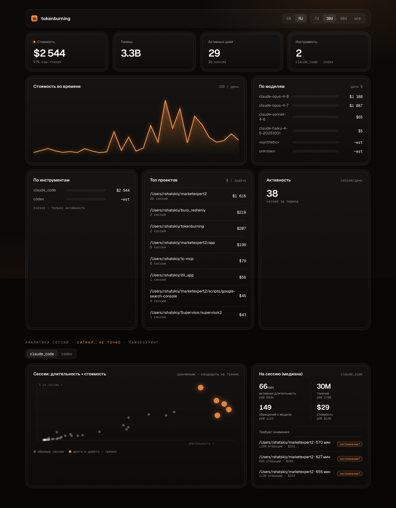

<div align="center">

# 🔥 tokenburning

**Единый дашборд по всему, что тебе стоят ИИ-инструменты для кода.**

Стоимость, токены, активность и аналитика сессий по Claude Code, Codex и Cursor — один статический бинарь, ставится за секунды, по умолчанию ничего не шлёт в сеть.

[](https://github.com/rshatskiy/tokenburning/actions/workflows/ci.yml)
[](https://github.com/rshatskiy/tokenburning/releases)
[](LICENSE)
[](go.mod)

[English version →](README.md) · [tokenburning.ru](https://tokenburning.ru) · [tokenburning.online](https://tokenburning.online)



</div>

---

## Зачем

Ты каждый день гоняешь Claude Code, Cursor и Codex — и понятия не имеешь, сколько это стоит суммарно и где именно сгорают деньги. Цифры лежат в трёх разных локальных форматах логов, и ни один из них не сводит их для тебя.

`tokenburning` читает эти логи **локально**, считает стоимость и показывает в одном виде: суммарный расход, куда он уходит по инструментам / моделям / проектам, и как на самом деле выглядят твои рабочие сессии. Один `curl | sh`, локальный дашборд, ничего не покидает машину.

> Команда? Есть опциональный роллап по согласию — см. [Команды](#команды--опциональный-роллап).

- **Локально в первую очередь.** Коллектор работает на твоей машине; дашборд слушает `127.0.0.1` с bearer-токеном. По умолчанию никаких сетевых вызовов.
- **Честно.** Модели без цены помечаются `~est`; аналитика сессий — «сигнал, не точно». Никаких догадок под видом фактов.
- **Приватность по построению.** Если согласишься на командный роллап, наверх уходят только *производные агрегаты* — без исходников, промптов, путей проектов и точных таймингов.

## Установка

**macOS / Linux:**
```sh
curl -fsSL https://raw.githubusercontent.com/rshatskiy/tokenburning/main/install.sh | sh
```

**Windows (PowerShell):**
```powershell
irm https://raw.githubusercontent.com/rshatskiy/tokenburning/main/install.ps1 | iex
```

Или скачай бинарь под свою ОС/архитектуру со страницы [Releases](https://github.com/rshatskiy/tokenburning/releases) (macOS, Linux, Windows × amd64/arm64).

## Использование

```sh
tokenburning scan        # разобрать локальные логи, показать стоимость по инструментам/моделям
tokenburning dashboard   # открыть локальный web-дашборд (127.0.0.1, под токеном)
tokenburning update      # самообновление до последней версии (с проверкой SHA-256)
tokenburning version
```

`scan` сразу даёт цифры:

```text
TOOL             EVENTS         TOKENS    COST(USD)
claude_code       17530     4013184183       2964.2
codex                 1          94109          0.0
cursor              494              0          0.0

MODEL                        EVENTS    COST(USD)
claude-opus-4-7                6251       1499.0
claude-opus-4-8                7062       1395.0
claude-sonnet-4-6              3778         65.1
claude-haiku-4-5-20251001       338          5.1
```

`dashboard` открывает полный визуальный вид (скриншот выше) — стоимость во времени, разбивки по инструментам / моделям / проектам и аналитику сессий — тёмная тема, без телеметрии.

## Пойми, как ты работаешь, а не только сколько тратишь

Стоимость и токены показывают **что ты тратишь** — это коммодити-слой, который показывают и сами инструменты. tokenburning добавляет вторую ось: **как ты работаешь.**

Session-level сигналы — активная длительность, число итераций за сессию и на чём концентрируется расход — помогают увидеть, как ты *на самом деле* работаешь с ИИ, а не только счёт. Это **сигнал, а не точное измерение** (длинная сессия намекает на паттерн, но не доказывает его), и это **твой** инсайт — чтобы понять свой стиль работы.

> На уровне команды это отдельный *depth*-слой по согласию: анонимно, только как когортные метрики при 5+ участниках, никогда не «руководитель смотрит за конкретным разработчиком». См. [Приватность](#модель-приватности).

## Фоновый сбор (опционально)

По умолчанию `tokenburning` ничего не делает в фоне. Включить периодический сбор с автозапуском при логине:

```sh
tokenburning enable                 # локальный фоновый сбор, интервал 15 мин
tokenburning enable --interval-min 30
tokenburning disable                # выключить
```

- **macOS:** LaunchAgent · **Linux:** systemd user-unit · **Windows:** Scheduled Task — всё без root.

## Команды — опциональный роллап

Нужен общий вид по команде? Зарегистрируйся, создай организацию, пригласи разработчиков — каждый получит команду в одну строку со своим токеном:

1. Зайди на **[tokenburning.ru](https://tokenburning.ru)** (или **[tokenburning.online](https://tokenburning.online)**) и войди по коду из письма.
2. Создай организацию и поделись инвайт-ссылкой с разработчиками.
3. На странице **Установка** скопируй свою команду и запусти на машине:
   ```sh
   tokenburning connect --to https://tokenburning.ru --token <ВАШ-ТОКЕН> --breadth
   ```

`connect` сохраняет конфиг, делает первый пробный push и включает фоновый сбор. Дальше коллектор шлёт **только производные агрегаты**, по расписанию, по выбранным категориям. В любой момент можно посмотреть, что именно уйдёт:

```sh
tokenburning push --breadth --depth --dry-run
```

## Модель приватности

```
┌─────────────────────────────┐        по согласию,             ┌──────────────────────────┐
│   Твоя машина (коллектор)   │     только производные агрегаты   │  Командный сервер (опц.) │
│                             │  ──────────────────────────────▶ │                          │
│  локальные логи → SQLite    │   без исходников · без промптов   │  дашборд организации     │
│  дашборд на 127.0.0.1       │   без путей проектов              │  когортные медианы (≥5)  │
│  вся детализация — здесь    │   без точных таймингов            │  breadth-факты по людям  │
└─────────────────────────────┘                                  └──────────────────────────┘
```

- **Контент никогда не покидает машину.** Payload отправки — агрегатные числа (стоимость, токены, активность, тренд по дням, медианы сессий) — проверяемо через `--dry-run`.
- **Сессионные сигналы — это сначала self-инсайт.** На твоей машине они твои. В командном роллапе это *depth*-слой: отдельное согласие, анонимно, показывается только как когортные метрики при **5+ участниках** — руководитель никогда не видит, как ведёт себя конкретный разработчик.
- **Когортное подавление.** Командные распределения (медианы/квартили) показываются только при **5+ участниках** с данными; меньше — скрыто.
- **Симметрия видимости.** Self-вид разработчика показывает ровно тот агрегат, что ушёл наверх — никакой скрытой отправки.
- **Настраиваемость.** Организация выбирает, сколько командного агрегата видят рядовые разработчики (`full` / `cohort_only` / `manager_only`).
- **Бинари пока без подписи.** macOS Gatekeeper: `xattr -d com.apple.quarantine /path/to/tokenburning` (установка через curl карантин не ставит). Windows SmartScreen: «Подробнее» → «Выполнить в любом случае».

## Архитектура

Этот репозиторий — **коллектор**: один статический Go-бинарь (`tokenburning`). Адаптеры для Claude Code (append-JSONL), Codex (гибрид) и Cursor (SQLite). Pure-Go SQLite (без CGO) → лёгкая кросс-компиляция. Всё в этом репо работает локально; ничего не уходит без твоего согласия.

Опциональная **командная платформа — это хостинговый сервис** на [tokenburning.ru](https://tokenburning.ru) / [tokenburning.online](https://tokenburning.online) (не входит в этот open-source репозиторий). Коллектор общается с ним только через `connect` / `push --to`, отправляя производные агрегаты по согласию — без исходников, промптов и путей проектов.

## Сборка из исходников

```sh
go build ./cmd/tokenburning   # коллектор
go test ./...
```

## Лицензия

[MIT](LICENSE) © Roman Shatskiy
